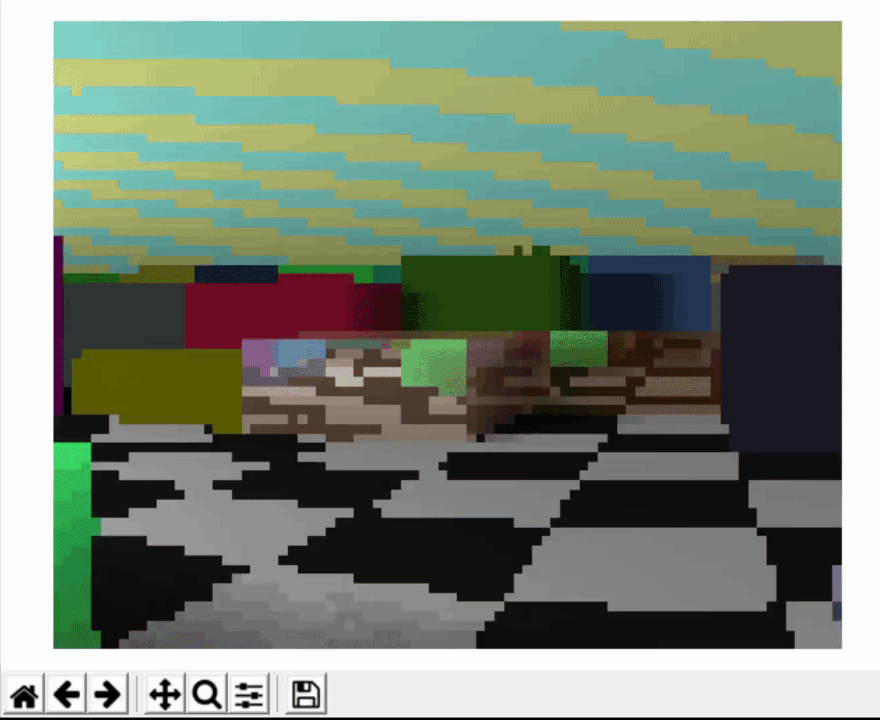

# pytracingMaze
A very simple 3D maze game made from scratch in python, with crude ray tracing graphics.

Requires: Numpy, Matplotlib, Pynput and Numba for single thread version, Multiprocessing for better performance.

Video tutorial here: https://youtu.be/IFmw6HM-uF0

 
 
 

