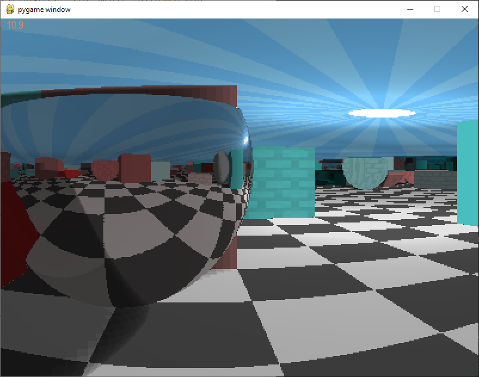

# PytracingMaze

MOST RECENT VERSION: [Pytracing Maze.py](https://github.com/FinFetChannel/PytracingMaze/blob/main/Pytracing%20Maze.py)

Also, executable for Windows available on [itch.io](https://finfetchannel.itch.io/pytracing-maze)

Simple ray tracing game in Python, based on my [ray casting project](https://github.com/FinFetChannel/RayCastingPythonMaze). As you may have guessed, things started to get a bit heavy for Python, so i had to resort to the Numba library, improving performance by 100x.

First video - 3D ray casting (proto ray tracing): https://www.youtube.com/watch?v=ravnXknUvvQ

Second video - reflections and shadows, attempted optimization: https://www.youtube.com/watch?v=IFmw6HM-uF0

Third video - Proper optimization, textures and spheres: https://www.youtube.com/watch?v=xHk8KCJ-99M



## Intro

### Rays

The basic approach is to trace rays of light in the reverse direction, starting from the camera and interacting with the environment, with three basic types of rays:

* Vision rays - Initial rays that shoots from the camera and returns the coordinates where it has hit something
* Reflection rays - Secondary rays cast when a vision ray hits a reflective surface, the new direction is the reflection of vision ray in relation to the normal vector of the surface, can have several bounces (reflections inside reflections)
* Shadow rays - Secondary rays that start where the vision ray has hit something and go in the direction of the light

### Maps

Maps are defined by grids, with different maps for different features: wall positions, colors, heights, reflectivities, textures and geometry (spheres or prisms). The maps are generated randomly, so each level and each game is a bit different. For that, a random walker algorithm is used, removing some walls from the map while traversing it, giving preference to pre-existing paths carved randomly.

### Game logic

The player starts on one side of the map and has the objective of finding a blue floor patch on the opposite side of the map. At each level the size of map gets bigger.

### Inputs

Basic inputs are similar to FPS games, with WASD for movement and mouse for orientation, the esc key is reserved for quitters.

## Code

The code is a bit messy, following the basic structure:

* Variables initialization
* Generate random map
  * Game loop
      * Check inputs
      * Movement
      * Calculate frame (with Numba)
         * Pixel loop
            * Initialize Vision ray
            * Vision Ray loop
               * Increment until reaching a surface
               * If hit reflective suface, reflect ray direction, else break out
           * Check pixel base color
           * Initialize Shadow ray
           * Shadow Ray loop
              * Increment until reaching light or blocked by something
           * Store pixel
       * Draw frame
       * Check if reached end of maze
   * Game over

Complexity arises from the different branches on block features wich may be combined (reflectivity, geometry, texture).

### Variables initialization

Several variables have to be initialized related to: maps, player's position and orientation, light position and additional support variables.

<details>
  <summary>Imports, map and initialization:</summary>

```python
def main():
    size = 25 # size of the map
    posx, posy, posz = (1.5, np.random.uniform(1, size -1), 0.5)
    rot, rot_v = (np.pi/4, 0)
    lx, ly, lz = (size/2-0.5, size/2-0.5, 1)    
    mr, mg, mb, maph, mapr, exitx, exity, mapt, maps = maze_generator(int(posx), int(posy), size)

    res, res_o = 5, [64, 96, 112, 160, 192, 224, 300, 400] # resolution options - width
    width, height, mod, inc, rr, gg, bb = adjust_resol(res_o[res])
        
    running = True
    pg.init()
    font = pg.font.SysFont("Arial", 18)
    screen = pg.display.set_mode((800, 600)) 
        
    clock = pg.time.Clock()
    pg.mouse.set_visible(False)
```

</details>


### Main game loop

The main game loop first checks for some user inputs (quit or change resolution), then the frame calculation frame is called (super_fast()), returning the pixel values. The pixel values are processed and displayed, after that the players movement is processed, checking if he has reached the exit and then checkin for new inputs.

<details>
  <summary>Main game loop</summary>

```python
 while running:
        
        for event in pg.event.get():
            if event.type == pg.QUIT: # quit game by closing window
                running = False
            if event.type == pg.KEYDOWN:
                if event.key == pg.K_ESCAPE: # quit game with esc
                    running = False
             
                if event.key == ord('q'): # lower resolution
                    if res > 0 :
                        res = res-1
                        width, height, mod, inc, rr, gg, bb = adjust_resol(res_o[res])
                if event.key == ord('e'): # higher resolution
                    if res < len(res_o)-1 :
                        res = res+1
                        width, height, mod, inc, rr, gg, bb = adjust_resol(res_o[res])
                        
        rr, gg, bb = super_fast(width, height, mod, inc, posx, posy, posz, rot, rot_v, mr, mg, mb, lx, ly, lz, maph, exitx, exity, mapr, mapt, maps, rr, gg, bb)
        
        pixels = np.dstack((rr,gg,bb))
        pixels = np.reshape(pixels, (height,width,3))

        surf = pg.surfarray.make_surface((np.rot90(pixels*255)).astype('uint8'))
        surf = pg.transform.scale(surf, (800, 600))
        screen.blit(surf, (0, 0))
        
        fps = font.render(str(round(clock.get_fps(),1)), 1, pg.Color("coral"))
        screen.blit(fps,(10,0))
        
        pg.display.update()

        # player's movement
        if (int(posx) == exitx and int(posy) == exity):
            break
        pressed_keys = pg.key.get_pressed()        
        posx, posy, rot, rot_v = movement(pressed_keys,posx, posy, rot, rot_v, maph, clock.tick()/500)
        pg.mouse.set_pos([400, 300])
        
    pg.quit() #Exit pygame
```

</details>

### Adjust resolution

Support function for easy resolution change

<details>
  <summary>Adjust resolution</summary>

```python
def adjust_resol(width):
    height = int(0.75*width)
    mod = width/64
    inc = 0.02/mod
    rr = np.random.uniform(0,1,width * height)
    gg = np.random.uniform(0,1,width * height)
    bb = np.random.uniform(0,1,width * height)
    print('Resolution: ', width, height)
    return width, height, mod, inc, rr, gg, bb
```
</details>

### Setting up a maze map

Firstly, a map is generated with blocks in random locations and random features, except on the edges of the map, where there are always full-height prismatic walls. After that, a random walker tries to reach the opposite side of the map, in the process some blocks are removed to give way. When it reaches the other side, the location is marked as the exit of the maze.

<details>
  <summary>Maze map setup</summary>

```python
def maze_generator(x, y, size):
    
    mr = np.random.uniform(0,1, (size,size)) 
    mg = np.random.uniform(0,1, (size,size)) 
    mb = np.random.uniform(0,1, (size,size)) 
    mapr = np.random.choice([0, 0, 0, 0, 1], (size,size))
    maps = np.random.choice([0, 0, 0, 0, 1], (size,size))
    mapt = np.random.choice([0, 0, 0, 1, 2], (size,size))
    maph = np.random.choice([0, 0, 0, 0, 0, 0, 0, .3, .4, .7, .9], (size,size))
    maph[0,:], maph[size-1,:], maph[:,0], maph[:,size-1] = (1,1,1,1)
    maps[0,:], maps[size-1,:], maps[:,0], maps[:,size-1] = (0,0,0,0)

    maph[x][y], mapr[x][y] = (0, 0)
    count = 0 
    while 1:
        testx, testy = (x, y)
        if np.random.uniform() > 0.5:
            testx = testx + np.random.choice([-1, 1])
        else:
            testy = testy + np.random.choice([-1, 1])
        if testx > 0 and testx < size -1 and testy > 0 and testy < size -1:
            if maph[testx][testy] == 0 or count > 5:
                count = 0
                x, y = (testx, testy)
                maph[x][y], mapr[x][y] = (0, 0)
                if x == size-2:
                    exitx, exity = (x, y)
                    break
            else:
                count = count+1
    mapt[np.where(mapr == 1)] = 0
    return mr, mg, mb, maph, mapr, exitx, exity, mapt, maps
```

</details>

### User inputs for movement

After each frame is drwan, the player's position and orientation are updated according to keyboard and mouse inputs, but the player can only move if the intended new position is not a wall.

<details>
  <summary>Input and movement</summary>

```python
def movement(pressed_keys,posx, posy, rot, rot_v, maph, et):
    
    x, y = (posx, posy)
    p_mouse = pg.mouse.get_pos()
    rot, rot_v = rot - (p_mouse[0]-400)/200, rot_v -(p_mouse[1]-300)/400
    rot_v = np.clip(rot_v, -1, 1)

    if pressed_keys[pg.K_UP] or pressed_keys[ord('w')]:
        x, y = (x + et*np.cos(rot), y + et*np.sin(rot))
        
    if pressed_keys[pg.K_DOWN] or pressed_keys[ord('s')]:
        x, y = (x - et*np.cos(rot), y - et*np.sin(rot))
        
    if pressed_keys[pg.K_LEFT] or pressed_keys[ord('a')]:
        x, y = (x - et*np.sin(rot), y + et*np.cos(rot))
        
    if pressed_keys[pg.K_RIGHT] or pressed_keys[ord('d')]:
        x, y = (x + et*np.sin(rot), y - et*np.cos(rot))
        
    if maph[int(x)][int(y)] == 0:
        posx, posy = (x, y)
                                                
    return posx, posy, rot, rot_v
```

</details>

### Casting rays

Rays are cast for each pixel, starting at the players current position with directions spaced uniformly in the pixel grid for a field of view of 60° horizontally and 45° vertically. When a ray hits something a few checks need to be made for height, shape, reflectivity, color and texture. After the base color of the pixel is defined, a new ray is cast from the last known position in the direction of the light to check if there is something directly blocking the light. Shadows are not affected by reflections for simplification.

<details>
  <summary>Generic rays</summary>

```python
def super_fast(args):

    for j in range(height): #vertical loop
    
        rot_j = rot_v + np.deg2rad(24 - j/mod) # vertical rotation
        
        for i in range(width): #horizontal vision loop
        
            rot_i = rot + np.deg2rad(i/mod - 30) # horizontal rotation
            x, y, z = (posx, posy, posz) # ray starts at the player's position
            sin, cos, sinz  = (inc*np.sin(rot_i), inc*np.cos(rot_i)), inc*np.sin(rot_j)  # x, y, z increments a.k.a. ray direction           

            while 1: # ray loop and reflections
                x += cos; y += sin; z += sinz # increment ray
                if "ray has hit something":
                    if "is a mirror":
                        "reflect ray"
                    else:
                        break
            
            "check for the color of the block where ray has hit"
            
            if z < 1: # ceiling has no shadows            
                "calculate new ray direction for shadow ray"
                while 1: # shadow ray
                    x += cos; y += sin; z += sinz # increment ray
                    if "ray has hit something":
                        "increase shading"
                    if "ray has reached ceiling" or "shading threshhold":
                        break
            
            "store pixel values"
```

</details>

#### First case: Regular walls with different heights and textures, ceiling and floor

The simplest case is when a ray hits a prismatic wall, that is, the checks for spheres and reflective blocks have failed. Then a base color for the pixel is retrieved and the texture is checked.

<details>
  <summary>Regular walls, ceiling and floor</summary>

```python
            if z > 1: # ceiling
                sh =(abs(np.sin(y+ly)+np.sin(x+lx))+6)/8
                if (x-lx)**2 + (y-ly)**2 < 0.1: #light source
                    c1, c2, c3 = 1, 1, 1
                elif int(np.rad2deg(np.arctan((y-ly)/(x-lx)))/6)%2 ==1:
                    c1, c2, c3 = 0.3*sh, 0.7*sh, 1*sh
                else:
                    c1, c2, c3 = .2*sh, .6*sh, 1*sh
                    
            elif z < 0: # floor
                
                if int(x*2)%2 == int(y*2)%2:
                    c1, c2, c3 = .8,.8,.8
                else:
                    if int(x) == exitx and int(y) == exity: #exit
                        c1, c2, c3 = 0,0,.6
                    else:
                        c1, c2, c3 = .1,.1,.1
                        
            elif maph[int(x)][int(y)] > 0: # walls
                c1, c2, c3 = mr[int(x)][int(y)], mg[int(x)][int(y)], mg[int(x)][int(y)]
                if mapt[int(x)][int(y)]: # textured walls
                    if y%1 < 0.05 or y%1 > 0.95:
                        ww = int((x*3)%1*4)
                    else:
                        ww = int((y*3)%1*4)
                    if x%1 < 0.95 and x%1 > 0.05 and y%1 < 0.95 and y%1 > 0.05:
                        zz = int(x*5%1*6)
                    else:
                        zz = int(z*5%1*6)
                    text = texture[zz][ww]
                    c1, c2, c3 = c1*text, c2*text, c3*text
            else:
                 c1, c2, c3 = .5,.5,.5 # if all fails
```

</details>

#### Second case: reflective prismatic walls

Reflective prismatic walls simply invert one of the components of direction of the rays. Surfaces facing up invert the z direction, sufaces facing the y direction (paralell to the xz plane) reflect the y direction and the same for the x direction. For that we can probe the blocks to sense which side of the wall we hit. A shading factor is introduced in reflections, making the darker while limiting the maximum number of reflections when a threshhold is reached. The color of the firs mirror is saved for a tinted mirror effect.

<details>
  <summary>Reflective walls</summary>

```python
                    elif mapr[int(x)][int(y)]: # check reflections
                        if modr == 1:
                            cx, cy = int(x), int(y)
                        modr  = modr*0.7
                        if modr < 0.2:
                            break
                        if abs(z-maph[int(x)][int(y)]) < abs(sinz):
                            sinz = -sinz
                        elif maph[int(x+cos)][int(y-sin)] == maph[int(x)][int(y)]:
                            cos = -cos
                        else:
                            sin = -sin
```
</details>

#### Third case: Spheres
Spheres allow for rays to pass through the corners of the walls when the distance to the center of the block is greater than the radius of the sphere. Spheres may also have reflections, the difference is that the new direction of the ray is calculated by reflecting it around the normal of the surface. Spheres can also be textured, but the texture mapping does not consider the curvature of the surface.

<details>
  <summary>Spheres</summary>

```python
                    if maps[int(x)][int(y)]: # check spheres
                        if ((x-int(x)-0.5)**2 + (y-int(y)-0.5)**2 + (z-int(z)-0.5)**2 < 0.25):
                            if (mapr[int(x)][int(y)]): # spherical mirror
                                if (modr == 1):
                                    cx, cy = int(x), int(y)
                                modr = modr*0.7
                                if (modr < 0.2):
                                    break
                                if (abs(maph[int(x)][int(y)] - z) <= abs(sinz)): ## horizontal surface
                                    sinz = -sinz
                                else:
                                    nx = (x-int(x)-0.5)/0.5; ny = (y-int(y)-0.5)/0.5; nz =(z-0.5)/0.5
                                    dot = 2*(cos*nx + sin*ny + sinz*nz)
                                    cos = (cos - nx*dot); sin = (sin - ny*dot); sinz = (sinz - nz*dot)
                                    x += cos; y += sin; z += sinz # avoid ray being trapped
                            else:
                                break
```

</details>

#### Shadow rays and shading
Before we start the Shadow ray loop, we check if the the shading was affected by reflections to mix the color of the pixel with the color of the mirror. We need to calculate the distance to the light source and new increments in its direction. The shading occurs incrementally, for softer edges, depending on the amount of material that is blocking the light. When a threshhold is reached, the ray is interrupted.

<details>
  <summary>Shading</summary>

```c++
            if modr < 1: # tinted mirrors
                c1r, c2r, c3r = mr[cx][cy], mg[cx][cy], mg[cx][cy]

            dtol = np.sqrt((x-lx)**2+(y-ly)**2+(lz-1)**2)
            modr = modr*(0.6 + 0.4/(dtol+0.001))
            if modr > 1:
                modr = 1
            if z < 1: # shadows
                cos, sin, sinz = .05*(lx-x)/dtol, .05*(ly-y)/dtol, .05*(lz-z)/dtol
                while 1:
                        
                    x += cos; y += sin; z += sinz
                    if maph[int(x)][int(y)]!= 0 and z<= maph[int(x)][int(y)]:
                        if maps[int(x)][int(y)]: # check spheres
                            if ((x-int(x)-0.5)**2 + (y-int(y)-0.5)**2 + (z-int(z)-0.5)**2 < 0.25):
                                modr = modr*0.9
                        else:    
                            modr = modr*0.9
                        if modr < 0.3:
                            break
                    if z > 1:
                        break
```

</details>

## Optimization

The naive approach with small increments is very inefficient. A much more compelling approach is to take advantage of the grid structure of the map, with a DDA algorithm (Digital differential analyzer), as presented by [Lode Vandevenne](https://lodev.org/cgtutor/raycasting.html). Ideally, we would create a grid in the z direction for full optimization with a true voxel space, I'm not doing that. I will simply call the DDA everytime the ray is at an empty cell to find the next non empty one. 

<details>
  <summary>DDA</summary>

```python
                if (maph[int(x)][int(y)] == 0 or (sinz > 0 and not maps[int(x)][int(y)])): ## LoDev DDA for optimization
                    
                    norm = np.sqrt(cos**2 + sin**2 + sinz**2)
                    rayDirX, rayDirY, rayDirZ = cos/norm, sin/norm, sinz/norm
                    
                    mapX, mapY = int(x), int(y)

                    deltaDistX, deltaDistY, deltaDistZ= abs(1/rayDirX), abs(1/rayDirY), abs(1/rayDirZ)

                    if (rayDirX < 0):
                        stepX, sideDistX = -1, (x - mapX) * deltaDistX
                    else:
                        stepX, sideDistX = 1, (mapX + 1.0 - x) * deltaDistX
                        
                    if (rayDirY < 0):
                        stepY, sideDistY = -1, (y - mapY) * deltaDistY
                    else:
                        stepY, sideDistY = 1, (mapY + 1 - y) * deltaDistY

                    if (rayDirZ < 0):
                        sideDistZ = z*deltaDistZ;
                    else:
                        sideDistZ = (1-z)*deltaDistZ

                    while (1):
                        if (sideDistX < sideDistY):
                            sideDistX += deltaDistX; mapX += stepX
                            dist = sideDistX; side = 0
                        else:
                            sideDistY += deltaDistY; mapY += stepY
                            dist = sideDistY; side = 1

                        if (maph[mapX][mapY] > 0):
                            break
                            
                    if (side):
                        dist = dist - deltaDistY
                    else:
                        dist = dist - deltaDistX
                        
                    if (dist > sideDistZ):
                        dist = sideDistZ

                    x = x + rayDirX*dist - cos/2
                    y = y + rayDirY*dist - sin/2
                    z = z + rayDirZ*dist - sinz/2
                    
                    ## end of LoDev DDA
```
</details>

To use it, we simply inject this code in the ray loop and in the shading loop. This results in a 2 to 3 times increase in performance, not too shabby.

## Complete ray function super_fast()

When we put everything together we get an enormous function, it's ugly, but it's super fast =).

<details>
  <summary>Complete function</summary>

```python
@njit(fastmath=True)
def super_fast(width, height, mod, inc, posx, posy, posz, rot, rot_v, mr, mg, mb, lx, ly, lz, maph, exitx, exity, mapr, mapt, maps, pr, pg, pb):

    texture=[[ .95,  .99,  .97, .8], # brick wall
             [ .97,  .95,  .96, .85],
             [.8, .85, .8, .8],
             [ .93, .8,  .98,  .96],
             [ .99, .8,  .97,  .95],
             [.8, .85, .8, .8]]
    idx = 0
    for j in range(height): #vertical loop 
        rot_j = rot_v + np.deg2rad(24 - j/mod)
        for i in range(width): #horizontal vision loop
            rot_i = rot + np.deg2rad(i/mod - 30)
            x, y, z = (posx, posy, posz)
            sin, cos,  = (inc*np.sin(rot_i), inc*np.cos(rot_i))
            sinz = inc*np.sin(rot_j)
            
            modr = 1
            cx, cy, c1r, c2r, c3r = 1, 1, 1, 1, 1
            while 1:
                if (maph[int(x)][int(y)] == 0 or (sinz > 0 and not maps[int(x)][int(y)])): ## LoDev DDA for optimization
                    
                    norm = np.sqrt(cos**2 + sin**2 + sinz**2)
                    rayDirX, rayDirY, rayDirZ = cos/norm, sin/norm, sinz/norm
                    
                    mapX, mapY = int(x), int(y)

                    deltaDistX, deltaDistY, deltaDistZ= abs(1/rayDirX), abs(1/rayDirY), abs(1/rayDirZ)

                    if (rayDirX < 0):
                        stepX, sideDistX = -1, (x - mapX) * deltaDistX
                    else:
                        stepX, sideDistX = 1, (mapX + 1.0 - x) * deltaDistX
                        
                    if (rayDirY < 0):
                        stepY, sideDistY = -1, (y - mapY) * deltaDistY
                    else:
                        stepY, sideDistY = 1, (mapY + 1 - y) * deltaDistY

                    if (rayDirZ < 0):
                        sideDistZ = z*deltaDistZ;
                    else:
                        sideDistZ = (1-z)*deltaDistZ

                    while (1):
                        if (sideDistX < sideDistY):
                            sideDistX += deltaDistX; mapX += stepX
                            dist = sideDistX; side = 0
                        else:
                            sideDistY += deltaDistY; mapY += stepY
                            dist = sideDistY; side = 1

                        if (maph[mapX][mapY] > 0):
                            break
                            
                    if (side):
                        dist = dist - deltaDistY
                    else:
                        dist = dist - deltaDistX
                        
                    if (dist > sideDistZ):
                        dist = sideDistZ

                    x = x + rayDirX*dist - cos/2
                    y = y + rayDirY*dist - sin/2
                    z = z + rayDirZ*dist - sinz/2
                    
                    ## end of LoDev DDA
                
                x += cos; y += sin; z += sinz
                if (z > 1 or z < 0): # check ceiling and floor
                    break
                if maph[int(x)][int(y)] > z: # check walls
                    if maps[int(x)][int(y)]: # check spheres
                        if ((x-int(x)-0.5)**2 + (y-int(y)-0.5)**2 + (z-int(z)-0.5)**2 < 0.25):
                            if (mapr[int(x)][int(y)]): # spherical mirror
                                if (modr == 1):
                                    cx, cy = int(x), int(y)
                                modr = modr*0.7
                                if (modr < 0.2):
                                    break
                                if (abs(maph[int(x)][int(y)] - z) <= abs(sinz)): ## horizontal surface
                                    sinz = -sinz
                                else:
                                    nx = (x-int(x)-0.5)/0.5; ny = (y-int(y)-0.5)/0.5; nz =(z-0.5)/0.5
                                    dot = 2*(cos*nx + sin*ny + sinz*nz)
                                    cos = (cos - nx*dot); sin = (sin - ny*dot); sinz = (sinz - nz*dot)
                
                                    x += cos; y += sin; z += sinz
                            else:
                                break
                                    
                                
                    elif mapr[int(x)][int(y)]: # check reflections
                        if modr == 1:
                            cx, cy = int(x), int(y)
                        modr  = modr*0.7
                        if modr < 0.2:
                            break
                        if abs(z-maph[int(x)][int(y)]) < abs(sinz):
                            sinz = -sinz
                        elif maph[int(x+cos)][int(y-sin)] == maph[int(x)][int(y)]:
                            cos = -cos
                        else:
                            sin = -sin
                    else:
                        break

                
            if z > 1: # ceiling
                sh =(abs(np.sin(y+ly)+np.sin(x+lx))+6)/8
                if (x-lx)**2 + (y-ly)**2 < 0.1: #light source
                    c1, c2, c3 = 1, 1, 1
                elif int(np.rad2deg(np.arctan((y-ly)/(x-lx)))/6)%2 ==1:
                    c1, c2, c3 = 0.3*sh, 0.7*sh, 1*sh
                else:
                    c1, c2, c3 = .2*sh, .6*sh, 1*sh
                    
            elif z < 0: # floor
                
                if int(x*2)%2 == int(y*2)%2:
                    c1, c2, c3 = .8,.8,.8
                else:
                    if int(x) == exitx and int(y) == exity: #exit
                        c1, c2, c3 = 0,0,.6
                    else:
                        c1, c2, c3 = .1,.1,.1
                        
            elif maph[int(x)][int(y)] > 0: # walls
                c1, c2, c3 = mr[int(x)][int(y)], mg[int(x)][int(y)], mg[int(x)][int(y)]
                if mapt[int(x)][int(y)]: # textured walls
                    if y%1 < 0.05 or y%1 > 0.95:
                        ww = int((x*3)%1*4)
                    else:
                        ww = int((y*3)%1*4)
                    if x%1 < 0.95 and x%1 > 0.05 and y%1 < 0.95 and y%1 > 0.05:
                        zz = int(x*5%1*6)
                    else:
                        zz = int(z*5%1*6)
                    text = texture[zz][ww]
                    c1, c2, c3 = c1*text, c2*text, c3*text
            else:
                 c1, c2, c3 = .5,.5,.5 # if all fails


            if modr < 1:
                c1r, c2r, c3r = mr[cx][cy], mg[cx][cy], mg[cx][cy]

            dtol = np.sqrt((x-lx)**2+(y-ly)**2+(lz-1)**2)
            modr = modr*(0.6 + 0.4/(dtol+0.001))
            if modr > 1:
                modr = 1
            if z < 1: # shadows
                cos, sin, sinz = .05*(lx-x)/dtol, .05*(ly-y)/dtol, .05*(lz-z)/dtol
                while 1:
                    if maph[int(x)][int(y)] < z and not maps[int(x)][int(y)]: ## LoDev DDA for optimization
                        
                        norm = np.sqrt(cos**2 + sin**2 + sinz**2)
                        rayDirX, rayDirY, rayDirZ = cos/norm, sin/norm, sinz/norm
                        
                        mapX, mapY = int(x), int(y)

                        deltaDistX, deltaDistY, deltaDistZ= abs(1/rayDirX), abs(1/rayDirY), abs(1/rayDirZ)

                        if (rayDirX < 0):
                            stepX, sideDistX = -1, (x - mapX) * deltaDistX
                        else:
                            stepX, sideDistX = 1, (mapX + 1.0 - x) * deltaDistX
                            
                        if (rayDirY < 0):
                            stepY, sideDistY = -1, (y - mapY) * deltaDistY
                        else:
                            stepY, sideDistY = 1, (mapY + 1 - y) * deltaDistY

                        if (rayDirZ < 0):
                            sideDistZ = z*deltaDistZ;
                        else:
                            sideDistZ = (1-z)*deltaDistZ

                        while (1):
                            if (sideDistX < sideDistY):
                                sideDistX += deltaDistX; mapX += stepX
                                dist = sideDistX; side = 0
                            else:
                                sideDistY += deltaDistY; mapY += stepY
                                dist = sideDistY; side = 1

                            if (maph[mapX][mapY] > 0):
                                break
                                
                        if (side):
                            dist = dist - deltaDistY
                        else:
                            dist = dist - deltaDistX
                            
                        if (dist > sideDistZ):
                            dist = sideDistZ

                        x = x + rayDirX*dist - cos/2
                        y = y + rayDirY*dist - sin/2
                        z = z + rayDirZ*dist - sinz/2
                        
                        ## end of LoDev DDA
                        
                    x += cos; y += sin; z += sinz
                    if maph[int(x)][int(y)]!= 0 and z<= maph[int(x)][int(y)]:
                        if maps[int(x)][int(y)]: # check spheres
                            if ((x-int(x)-0.5)**2 + (y-int(y)-0.5)**2 + (z-int(z)-0.5)**2 < 0.25):
                                modr = modr*0.9
                        else:    
                            modr = modr*0.9
                        if modr < 0.3:
                            break
                    if z > 1:
                        break
                    
            pr[idx] = modr*np.sqrt(c1*c1r)
            pg[idx] = modr*np.sqrt(c2*c2r)
            pb[idx] = modr*np.sqrt(c3*c3r)
            idx += 1

    return pr, pg, pb
```
</details>
